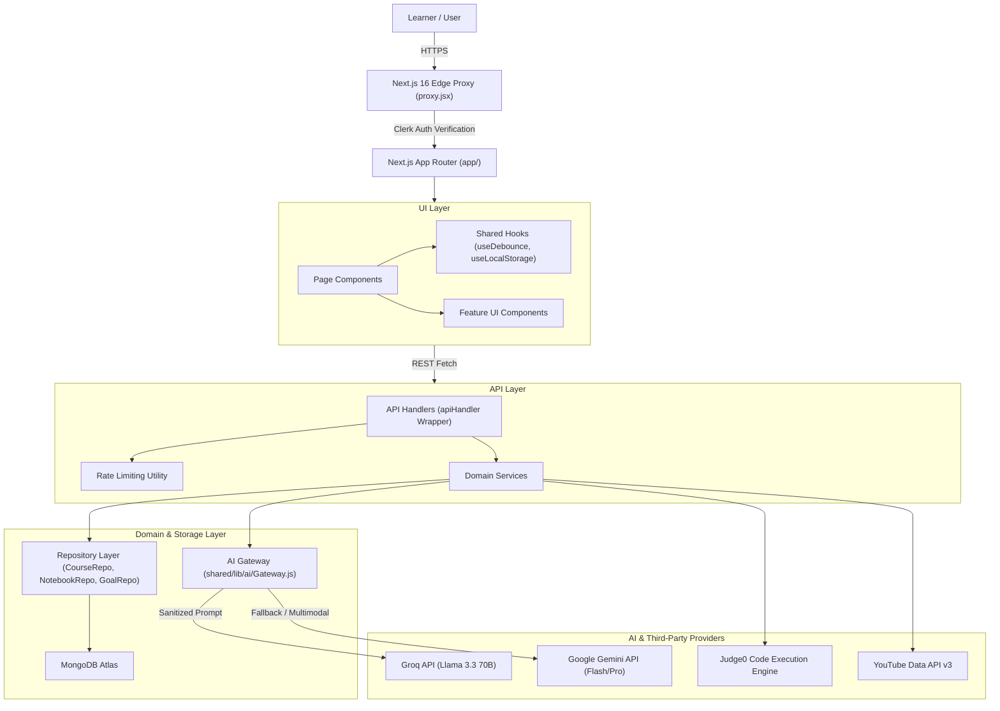
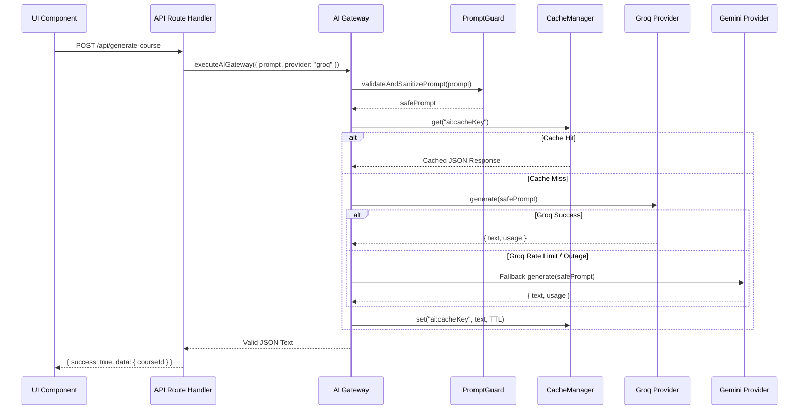

# TutorX — Architecture & C4 System Diagrams

## 1. High-Level System Architecture

```mermaid
graph TD
    User["Learner / User"] -->|HTTPS| Edge["Next.js 16 Edge Proxy (proxy.jsx)"]
    Edge -->|Clerk Auth Verification| AppRouter["Next.js App Router (app/)"]
    
    subgraph Frontend [UI Layer]
        Pages["Page Components"] --> Hooks["Shared Hooks (useDebounce, useLocalStorage)"]
        Pages --> Components["Feature UI Components"]
    end
    
    subgraph Backend [API Layer]
        RouteHandlers["API Handlers (apiHandler Wrapper)"] --> RateLimiter["Rate Limiting Utility"]
        RouteHandlers --> Services["Domain Services"]
    end
    
    subgraph Core [Domain & Storage Layer]
        Services --> AIGateway["AI Gateway (shared/lib/ai/Gateway.js)"]
        Services --> Repositories["Repository Layer (CourseRepo, NotebookRepo, GoalRepo)"]
        Repositories --> Mongo["MongoDB Atlas"]
    end
    
    subgraph External [AI & Third-Party Providers]
        AIGateway -->|Sanitized Prompt| Groq["Groq API (Llama 3.3 70B)"]
        AIGateway -->|Fallback / Multimodal| Gemini["Google Gemini API (Flash/Pro)"]
        Services --> Judge0["Judge0 Code Execution Engine"]
        Services --> YouTube["YouTube Data API v3"]
    end

    AppRouter --> Frontend
    Frontend -->|REST Fetch| Backend
```

## 2. AI Gateway Request Flow

```mermaid
sequenceDiagram
    participant Client as UI Component
    participant Route as API Route Handler
    participant Gateway as AI Gateway
    participant Guard as PromptGuard
    participant Cache as CacheManager
    participant Groq as Groq Provider
    participant Gemini as Gemini Provider

    Client->>Route: POST /api/generate-course
    Route->>Gateway: executeAIGateway({ prompt, provider: "groq" })
    Gateway->>Guard: validateAndSanitizePrompt(prompt)
    Guard-->>Gateway: safePrompt
    Gateway->>Cache: get("ai:cacheKey")
    
    alt Cache Hit
        Cache-->>Gateway: Cached JSON Response
    else Cache Miss
        Gateway->>Groq: generate(safePrompt)
        alt Groq Success
            Groq-->>Gateway: { text, usage }
        else Groq Rate Limit / Outage
            Gateway->>Gemini: Fallback generate(safePrompt)
            Gemini-->>Gateway: { text, usage }
        end
        Gateway->>Cache: set("ai:cacheKey", text, TTL)
    end
    
    Gateway-->>Route: Valid JSON Text
    Route-->>Client: { success: true, data: { courseId } }
```
